# GhostlyTemplates

> ## Easy

### 1. Overview

Let's go through the webpage before reading the source code! I see a **render feature** with url input, the server reads my input and renders the content of that URL! I try `https://google.com`, after reading a HTML source of result page, I think server reads all HTML content from my url and render it! 

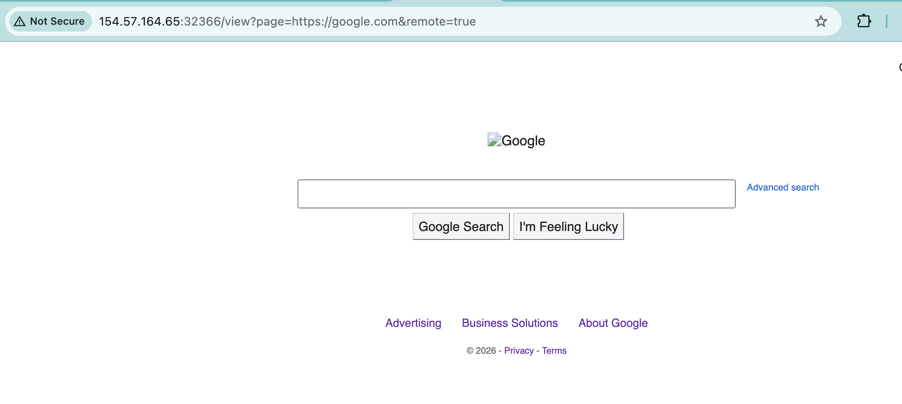

The default page is `index.tpl` (tpl for template)! So I think the main vector of this challenge can be `SSRF` with a custom webpage containing malicious content or `Path Traversal` with `page` input. 

Now let's read and analyze a source code of this web page! The main point of interest for me is how the web server handles `/view` requests with `page` and `remote` input.

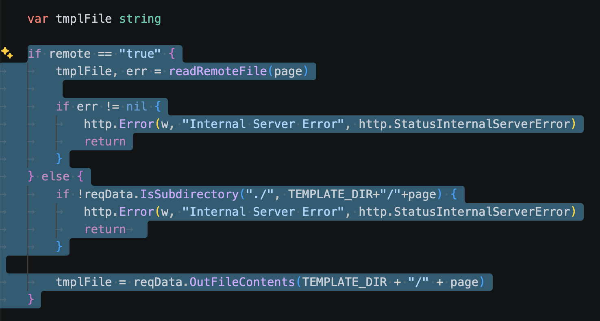

If `remote=true`, the server gets content from my url and renders it. Conversely, the server reads file with file name is input of `page` value and return content of this file. I try to check if `IsSubDirectory` is safe. After reading and testing for it, I think it is safe! I can't use `Path Traversal` by any way! Because the server validates the file path against the templates directory and block it if not in templates. But the good signal is the server reflect my input if error!

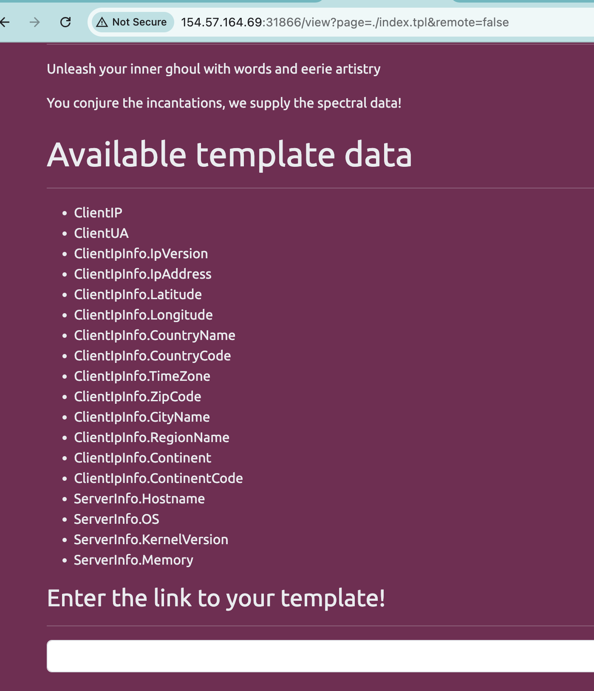
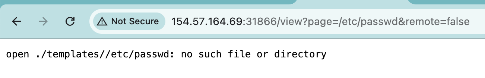
*Reflect user input*

### 2. Enumeration

Reading how golang server render the web page, and researching Go-specific SSTI for SSTI vulnerabilities, I think the main vector is to use error reflect user input to running malicious code. This [post](https://onsecurity.io/article/go-ssti-method-research/) is perfect for learning **SSTI in Golang**! Why do I know `SSTI`? No I only think about the core vector attack if server reflect user input, `SSTI`, `XSS` in this challenge, with `remote=true`, `SSRF` is possible for exploiting. Because I can read a source code and I know where is flag? How can i get it? By visit `/flag` page with admin account? By read from the server? Or any way, in whitebox challenge, the core advantage is you know what you need to do!

Return to the web challenge, after reading about how Go can be exploit with `SSTI`, the core vulnerabilities reason is *render* the same as python, Golang misinterprets `{{.}}` as template logic instead of a literal string, it is a Golang code, the template run this and render the result, but in Golang, everything looks safe! Because the *Context* of the template, what you can use depends on the *Context* or the *Object* server side pass to `Execute` function! In this post is `User`, and in source code is `RequestData`.

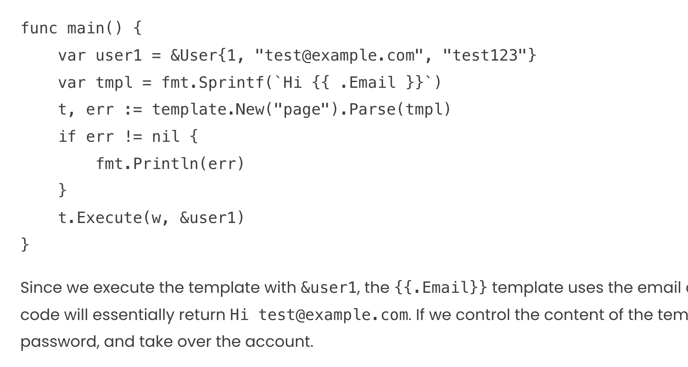
*User Object*

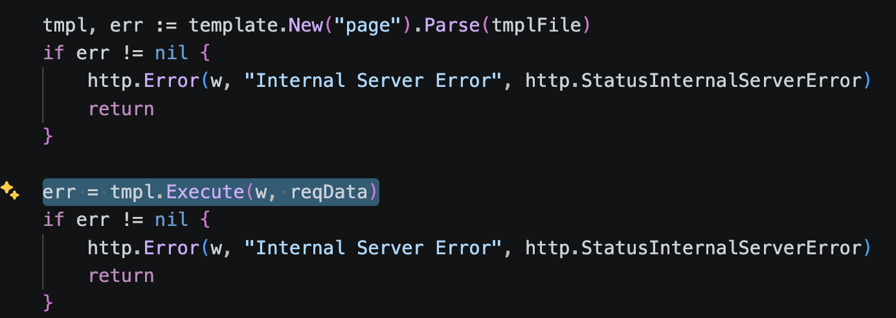
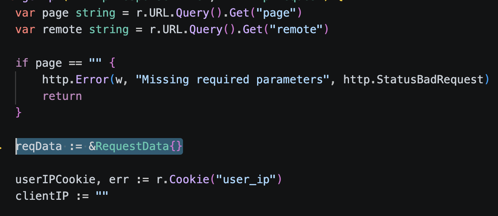
*RequestData Object*

In `SSTI` in Golang post, the core vulnerabilities is hacker can control the `{{.<Method or Attribute>}}` for using Object run malicious Go code. In this post, they can use `.Email` for get email attribute of user. In this challenge, I try for `{{.}}` which payload for knowing about context of `Execute` function. 

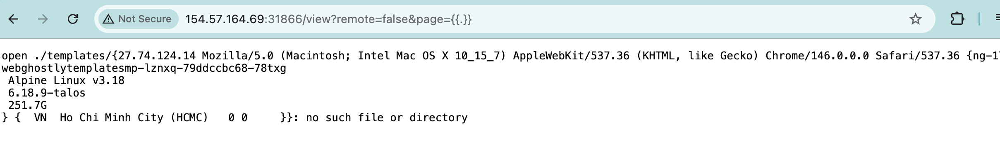
*`{{.}}` payload*

Boom!! This is correctly `RequestData`! 

### 3. Exploitation

Now we need to read `/flag.txt` file, in **Golang SSTI**, I can't execute any code, it depends on what Object is in context. Read source code, you can see `RequestData` has `OutFileContent` method for read file in local! It is what we need! Now the payload need to call `OutFileContent` method with `"/flag.txt"` argument. 

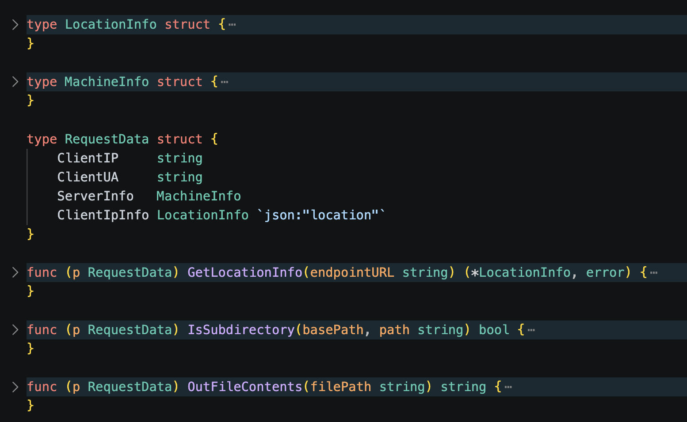
*struct RequestData*

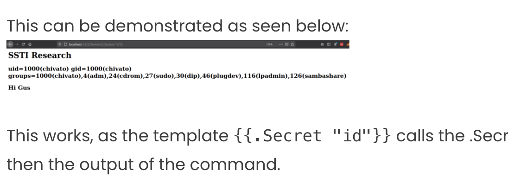
*How to call method with arguments in payload?*

Finally payload is `{{.OutFileContents "/flag.txt"}}`, I think more for some bypass `flag.txt` in input is `{{.OutFileContents "\x2f\x66\x6c\x61\x67\x2e\x74\x78\x74"}}` 

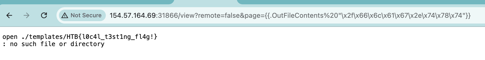

More than flag, in `remote=true`, I notice that if we have a public server return malicious contet such as `{{.}}` the template render of Go can return the same with error page. For testing, I host a public server return only `{{.}}` when get! 

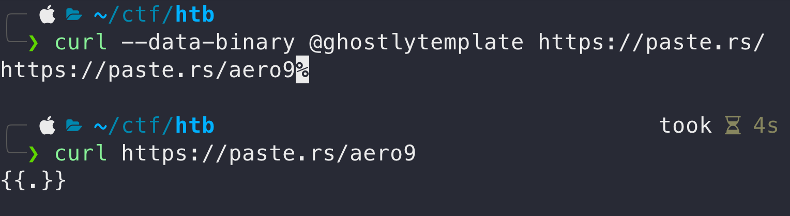 

Now I have a public page return a payload for `SSTI` in Golang! Let's try it! 

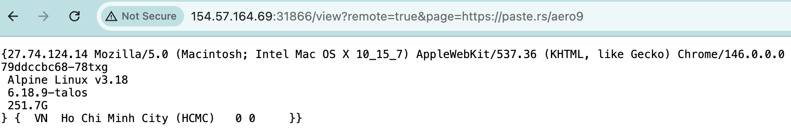

Booomm!! The same vulnerabilities!

To make it even more interesting, I tried an interesting payload! `{{.ServerInfo.Memory}}`, yeah! I can *get out* the context!!

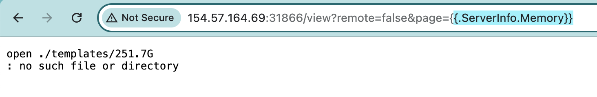

### 4. Root Cause

The root cause of this vulnerability lies in the insecure handling of the template rendering process. **Dynamic Template Parsing**, the application uses `Parse` on a string `tmplFile`, which is entirely user-controlled text!
