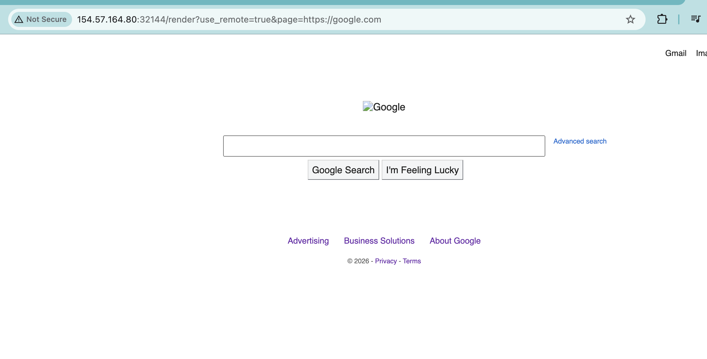
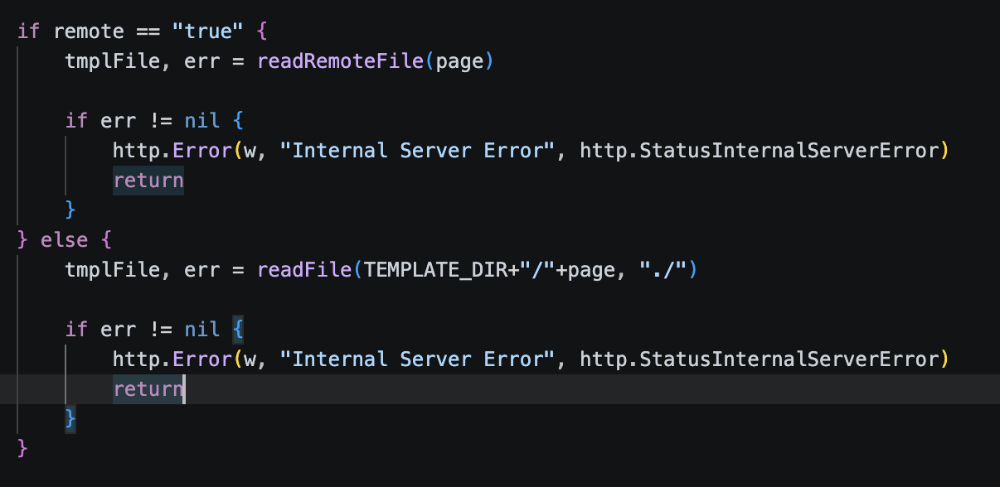
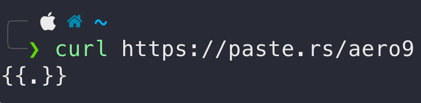
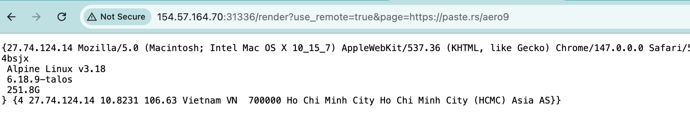
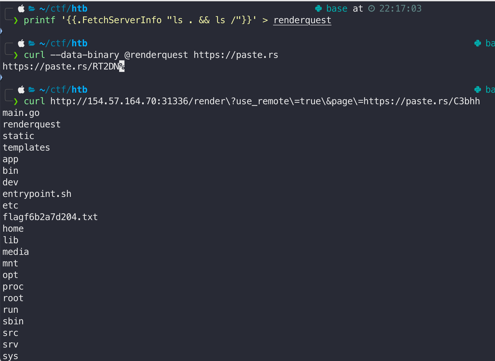

# RenderQuest

> ## Easy

### 1. Overview

Before reading the source code, I visited the webpage, it is a rendering tool, where I input a link and the server renders the target page.

*Input with Google*

The default page is `index.tpl`, so I thought the core vulnerability of this challenge was `SSRF` or `Path traversal` via the `page=index.tpl` paramenter. 

Now I will analyze the source code of this challenge, which is the key to *hack* it!

Wow, the source code of this challenge is the same as `GhostlyTemplates`, but the file reading function isn't in the context object. The error doesn't respond to the user and does not render the user input when `remote=false`.

### 2. Enumeration

I highly recommend you read my writeup [GhostlyTemplates](https://github.com/Shurayz287/HTB-Writeups/tree/main/web-challenges/easy/GhostlyTemplates), which has the same attack vector as **RenderQuest**: **Golang SSTI**! Now I need to create a payload file `{{.}}` and host it publicly to inject it into the server with `remote=true`. 

*Public payloads url*

Yeah, the payload works! 

### 3. Exploitation

Reading source code, the context is `RequestData`, but it doesn't have a method to read files. Don't worry, `RequestData` has `FetchServerInfo` for running commands! This leads to **RCE** via **SSTI** in this challenge! Now let's design a payload to read the flag file! 

Create a `ls` payload to find the flag file! `{{.FetchServerInfo "ls . && ls /"}}` 

Yeah, the flag file is `/flagf6b2a7d204.txt`. Let's make a payload to `cat` this and get the flag!

### 4. Root Cause

Similar to `GhostlyTemplates`, the vulnerability stems from insecure dynamic template parsing combined with excessive method exposure in Golang's html/template. However, this challenge is of higher degree of severity. `FetchServerInfo` method helps hacker RCE the server! It's the worst way for a server to get attacked!
