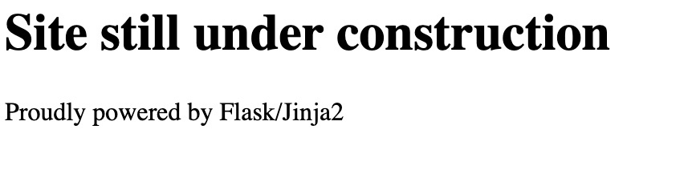
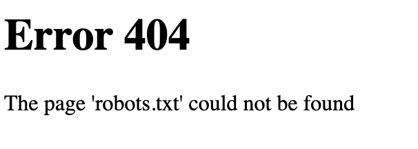
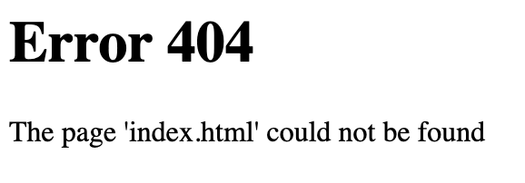
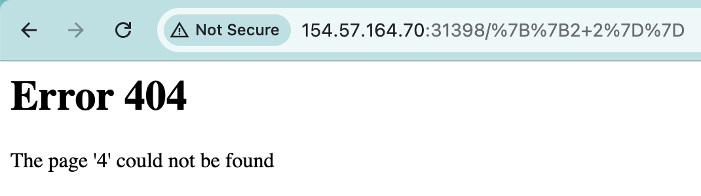
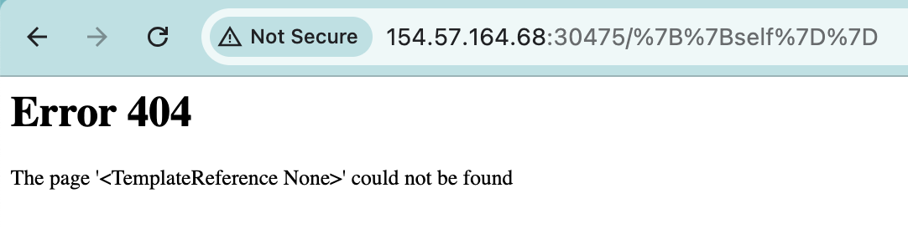
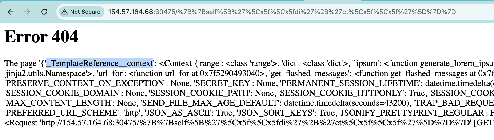
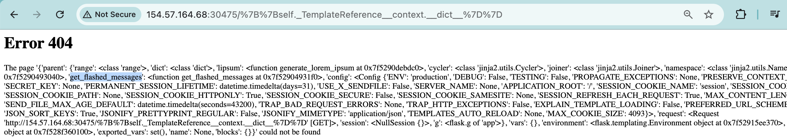
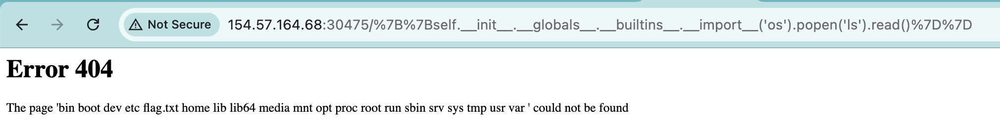
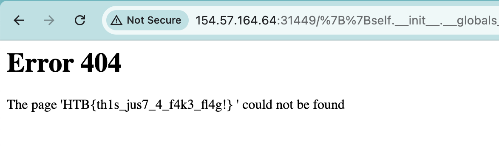

# Templated

> ## Easy

### 1. Overview

Let's go through the webpage now! 

I only see a single page with **Flask** framework and **Jinja2** template! I try for `robots.txt`, `index.html` but nothing works.

 

### 2. Enumeration

Look at the error message, it reflects user input! Yes, we can inject it! Since the webpage uses the **Jinja2** template engine, I try `{{2+2}}`! And Booom!!

The result is 4! `SSTI` is here!

### 3. Exploitation

Going to exploit the webpage and get the flag, the core payload which I usually use is `{{self.__init__.__globals__.__builtins__.__import__('os').popen('id').read()}}`. If you want to know how it works, i highly recommend you read this [post](https://onsecurity.io/article/server-side-template-injection-with-jinja2/)! To me, the core vulnerability lies in the misunderstanding of the template language's sandbox mechanism. We just can use some harmless stuff for making the malicious payload! 

There are many ways to design a payloads and there are so many payloads that serve the same purpose. Such as the same payload for call `id` in shell is `{{ self._TemplateReference__context.cycler.__init__.__globals__.os.popen('id').read()}}`. In some case, you can't use this payload because server don't recieve `.` in input, you can use `[]`! `{{self['__init__']['__globals__']['__builtins__']['__import__']('os')['popen']('id')['read']()}}` for the same purpose. If the server doesn't receive `os` or `globals` or `_`, you can replace with `\x6f\x73` for `os` and `\x5f` for `_`. Because that in the `'` for string, so you can represent with another way! Or you can use `['o' + 's']`! With me, I usually build from `{{self}}` and use `.__dict__` or `['\x5f\x5fdi'+'ct\x5f\x5f']` for defining what class I can use?

*self* 

*self.\_\_dict\_\_* 

*self.\_TemplateReference\_\_context.\_\_dict\_\_* 

And you can climb up to find \_\_import\_\_ and use it for **RCE** by Python! Now we capture the flag with command `ls` and `cat flag.txt`!

### 4. Root Cause

The root cause of this **Server-Side Template Injection (SSTI)** vulnerability is the insecure use of the `render_template_string()` function in Flask. Instead of safely passing user input as a variable into a predefined template structure, the application concatenates the raw user input directly into the template string before rendering it. This architectural flaw allows the **Jinja2** engine to evaluate and execute any template syntax (such as `{{ }}`) maliciously injected by the user.
