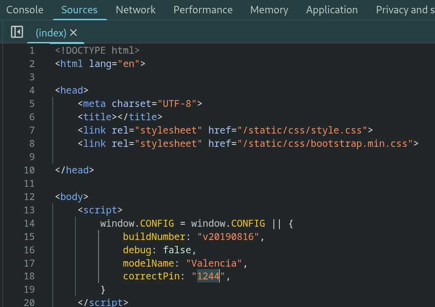
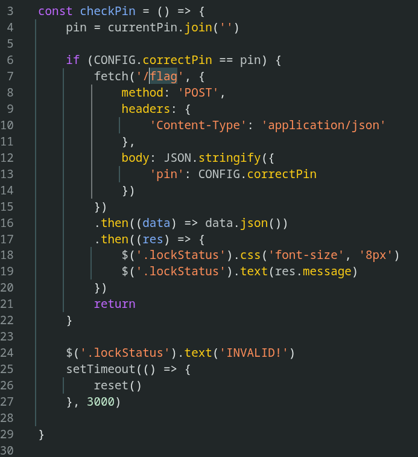

# Trapped Source

> ## Very Easy

### 1. Overview

Navigating through the site, I noticed that the web page provides the *digital lock* and we can get the flag by typing the correct pin!


### 2. Enumeration

Open devtool in chrome, I read the source code, my attention is focused on `correctPin` value in source!



I think, if I type correct pin, the frontend calls `getflag` function and give me the flag, so to know more about the target, I try to read the script js code! Now you see 2 files `jquery.js` and `script.js`, `jquery.js` is a JavaScript library file, so this isn't the human-written file, you should to read `script.js`!

In `script.js` file, the most noteworthy point for me is `checkPin` function, because it calls `/flag` API from server. Deeper analysis this source, you can see, the format to call `/flag`, I found this very interesting!



### 3. Exploitation

As mentioned before, next I try `correctPin` in source, and I get the flag of this challenge!


But I'm still curious whether I can use `curl` with `POST` method to call `/flag` API and following format in `script.js` file? Yeah, you can try this with me! Note that you need to change my target IP by your target IP!

```bash
curl http://154.57.164.74:31511/flag -X POST -H 'Content-Type: application/json' --data-raw '{"pin":""}'
{"message":"All fields required!"}
curl http://154.57.164.74:31511/flag -X POST -H 'Content-Type: application/json' --data-raw '{"pin": "0000"}'
{"message":"HTB{flag_of_this_challenge}\n"}
```

But I want to try an incorrect pin, I want to try this! And yeah, server doesn't check my pin!! It only returns the flag if someone sends the request without empty `pin` value!

### 4. Root Cause

This vulnerability happens because 2 issues. First, seeing the correct pin value in the frontend source is **Sensitive Data Exposure**. Second, which you see the server doesn't check the pin from the request, which is **Lack of Validation**!
